<!-- kunkey github profile readme -->

  <!-- Banner -->
  

    

  <!-- Animated Greeting & Typing Subtitle -->
  <h1>
    Hi there , I'm <a href="https://kunkey.dev">kunkey</a>!
  </h1>

  

    

  <!-- Profile Status & Badges -->
  

    
    &nbsp;
    
    &nbsp;
    
  

<!-- Animated Cyber Line Divider -->

<h2 align="center">🏆 GitHub Trophies 🏆</h2>

 

  

 
<!-- Animated Cyber Line Divider -->

<h2 align="center">⚡ About Me ⚡</h2>

 

  <table border="0">
    <tr>
      <td align="center" valign="middle">
        
      </td>
      <td align="left" valign="middle">
        

          🚀 <b>Full-Stack Web Developer</b> specializing in the <b>MERN Stack</b> & Modern Web Technologies. 
          💡 Passionate about building high-performance applications, continuous self-improvement & writing clean code.
        

        

        <code>🔭 <b>Currently working on</b> : Modern Web Applications & Microservices</code> 
        <code>🌱 <b>Currently learning</b>   : Cloud Architecture, Docker & Advanced DevOps</code> 
        <code>💬 <b>Ask me about</b>         : JavaScript, TypeScript, React, Node.js, Express, PHP</code> 
        <code>⚡ <b>Fun Fact</b>             : Turn caffeine into clean, scalable code ☕</code>
      </td>
    </tr>
  </table>

 
<!-- Animated Cyber Line Divider -->

<h2 align="center">💻 Tech Stack Matrix 💻</h2>

 

  <!-- Interactive Skill Icons Grid -->
  

  

  ### 🌐 Languages & Frontend
  

    
    
    
    
    
    
    
  

  ### ⚙️ Backend & Databases
  

    
    
    
    
    
    
    
    
    
  

  ### 🧰 DevOps & Infrastructure
  

    
    
    
    
    
    
  

 
<!-- Animated Cyber Line Divider -->

<h2 align="center">🐍 Contribution Snake Game 🐍</h2>

 

  <picture>
    <source media="(prefers-color-scheme: dark)" srcset="https://raw.githubusercontent.com/kunkey/kunkey/output/github-contribution-grid-snake-dark.svg" />
    <source media="(prefers-color-scheme: light)" srcset="https://raw.githubusercontent.com/kunkey/kunkey/output/github-contribution-grid-snake.svg" />
    
  </picture>

 
<!-- Animated Cyber Line Divider -->

<h2 align="center">📊 GitHub Analytics & Commit Activity 📊</h2>

 

  

 

  

 

  <table border="0">
    <tr>
      <td align="center" valign="top" width="50%">
        
      </td>
      <td align="center" valign="top" width="50%">
        
      </td>
    </tr>
  </table>

 
<!-- Animated Cyber Line Divider -->

<h2 align="center">📌 Featured Projects 📌</h2>

 

  

    🚀 Explore all repositories & open-source projects on <a href="https://github.com/kunkey?tab=repositories" target="_blank"><b>GitHub Repositories</b></a>!
  

 
<!-- Animated Cyber Line Divider -->

<h2 align="center">🌐 Connect With Me 🌐</h2>

 

  

    
    &nbsp;
    
    &nbsp;
    
    &nbsp;
    
  

   

  

    
    &nbsp;&nbsp;&nbsp;&nbsp;
    
    &nbsp;&nbsp;&nbsp;&nbsp;
    
    &nbsp;&nbsp;&nbsp;&nbsp;
    
  

 
<!-- Animated Cyber Line Divider -->

<h2 align="center">📑 Favorite Quote 📑</h2>

 

  

  

  <a href="#kunkey-github-profile-readme"><b>⬆️ Back to Top</b></a>

